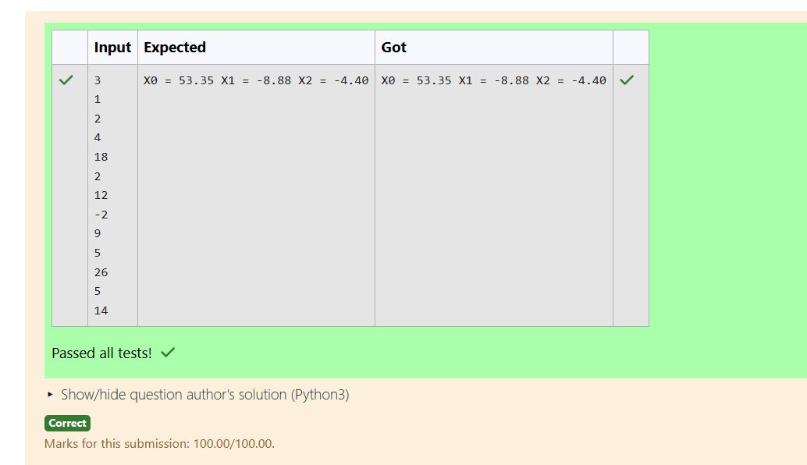

# Gaussian Elimination

## AIM:
To write a program to find the solution of a matrix using Gaussian Elimination.

## Equipments Required:
1. Hardware – PCs
2. Anaconda – Python 3.7 Installation / Moodle-Code Runner

## Algorithm
1. 
2. 
3. 
4. 

## Program:

Program to solve a matrix using Gaussian elimination without partial pivoting.
Developed by: RAMYA R

RegisterNumber: 212223230169

```
import numpy as np
n=int(input())
matrix=np.zeros((n,n+1))
x=np.zeros(n)
for i in range(n):
    for j in range(n+1):
        matrix[i][j]=int(input())
for i in range(n):
    for j in range(i+1,n):
        ratio=matrix[j][i]/matrix[i][i]
        for k in range(n+1):
            matrix[j][k]=matrix[j][k]-ratio*matrix[i][k]
#Back substitution
x[n-1]=matrix[n-1][n]/matrix[n-1][n-1]
for i in range(n-2,-1,-1):
    x[i]=matrix[i][n]
    for j in range(i+1,n):
        x[i]=x[i]-matrix[i][j]*x[j]
    x[i]=x[i]/matrix[i][i]
for i in range(n):
    print("X%d = %0.2f" %(i,x[i]),end=" ")
```

## Output:




## Result:
Thus the program to find the solution of a matrix using Gaussian Elimination is written and verified using python programming.

